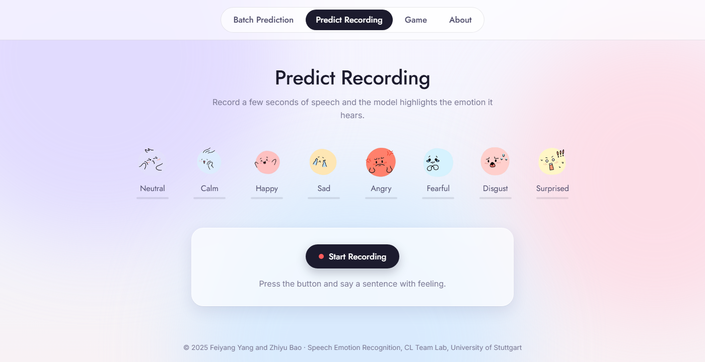

# Speech Emotion Recognition on RAVDESS

[](https://github.com/amnesiackid/automatic-speech-emotion-recognition-on-ravdess/actions/workflows/ci.yml)
[](https://python.org)
[](https://huggingface.co/amnesiackid/distilhubert-finetuned-ravdess)
[](https://huggingface.co/datasets/amnesiackid/ravdess-emotion-intensity)

Classify the emotion in a short speech recording as one of eight classes:
`neutral`, `calm`, `happy`, `sad`, `angry`, `fearful`, `disgust`, `surprised`.

The main model is [DistilHuBERT](https://huggingface.co/ntu-spml/distilhubert) fine-tuned end-to-end
on the [RAVDESS](https://zenodo.org/records/1188976) speech corpus. It reaches **86.8 % accuracy** on a
held-out 20 % split and is published on the Hugging Face Hub as
[`amnesiackid/distilhubert-finetuned-ravdess`](https://huggingface.co/amnesiackid/distilhubert-finetuned-ravdess).
Two earlier models built during the project are kept as documented experiments.

> Student project for *Computational Linguistics Team Laboratory: Phonetics*,
> Institute for Natural Language Processing, University of Stuttgart.
> Authors: Feiyang Yang and Zhiyu Bao. Full write-up: [`docs/report.pdf`](docs/report.pdf).

## Results

| Model | Input | Training data | Accuracy | Code |
|---|---|---|---|---|
| **DistilHuBERT, fine-tuned** | raw 16 kHz waveform | RAVDESS (1 440 clips) | **86.8 %** | [`src/ser/`](src/ser), [`notebooks/03`](notebooks/03_distilhubert_finetune.ipynb) |
| Frozen wav2vec2 features + 1D CNN | wav2vec2-base hidden states | RAVDESS | 67.2 % ¹ | [`experiments/wav2vec2_cnn/`](experiments/wav2vec2_cnn) |
| 1D CNN on hand-crafted features (baseline) | ZCR + RMS + MFCC | RAVDESS + CREMA-D + TESS + SAVEE | 56.7 % ¹ | [`experiments/baseline_cnn/`](experiments/baseline_cnn) |

Accuracy is measured on a 20 % split of RAVDESS (seed 42). ¹ As reported in the write-up; see the
experiment READMEs for what can and cannot be reproduced from this repository.

## Quick start

```bash
git clone https://github.com/amnesiackid/automatic-speech-emotion-recognition-on-ravdess.git
cd automatic-speech-emotion-recognition-on-ravdess
python -m venv .venv && source .venv/bin/activate   # Windows: .venv\Scripts\activate
pip install -e .
```

Classify a file from the command line (the model is downloaded on first use, about 95 MB):

```bash
ser-predict path/to/speech.wav
```

```
Loading amnesiackid/distilhubert-finetuned-ravdess ...

path/to/speech.wav
  -> sad (84.9%)

  sad          84.9%  #########################
  disgust      11.4%  ###
  fearful       1.7%
  ...
```

Or from Python:

```python
from ser import classify

classify("path/to/speech.wav")
# {'emotion': 'sad', 'confidence': 0.8491, 'probabilities': {'sad': 0.8491, 'disgust': 0.1145, ...}}
```

`classify` is a thin wrapper around the Hugging Face pipeline, which you can also use directly:

```python
from transformers import pipeline

classifier = pipeline("audio-classification", model="amnesiackid/distilhubert-finetuned-ravdess")
classifier("path/to/speech.wav")
```

## Web demo and REST API



```bash
pip install -e ".[server]"
python server/app.py
```

Open <http://localhost:5000>. The page lets you record from the microphone or upload a file and
highlights the predicted emotion. The same server exposes a small JSON API:

| Method | Endpoint | Description |
|---|---|---|
| `POST` | `/predict` | multipart form with an `audio` file; returns `emotion`, `confidence`, `probabilities` |
| `GET` | `/emotions` | the eight labels in model order |
| `GET` | `/health` | liveness check |

```bash
curl -X POST http://localhost:5000/predict -F "audio=@speech.wav"
```

Docker:

```bash
docker build -t ser-api .
docker run -p 5000:5000 ser-api
```

## Training and evaluation

The pipeline is three scripts in `src/ser/`; a GPU is strongly recommended for training.

```bash
pip install -e ".[train]"
python -m ser.data --output ravdess_encoded              # download, resample to 16 kHz, split
python -m ser.train --data ravdess_encoded --epochs 20   # add --push-to-hub to publish
python -m ser.evaluate --data ravdess_encoded --robustness --output-dir results/
```

`ser.data` writes raw 16 kHz waveforms with `train` / `validation` / `test` splits. The test split is
the same seed-42 20 % the published model was scored on; the validation split (10 %, stratified) is
carved out of the training portion and is what `ser.train` uses to pick the best epoch. Pass
`--split-by-actor` to hold out whole speakers instead, which is the honest setting for "how does it
do on a voice it has never heard".

### Why the published model fails on microphone recordings

The published model was trained on clean studio clips with no augmentation and, per its config,
SpecAugment off; its training loss reached 0.002, so it memorised the corpus. On the clean test split
it is fine, but with background noise it collapses onto a few classes, which is exactly what users
report ("almost only calm and disgust"):

| Condition (RAVDESS test split, 288 clips) | Accuracy | What it predicts |
|---|---|---|
| clean | 85.4 % | all eight classes, balanced |
| + white noise, 20 dB SNR | 44.4 % | fearful, disgust, sad, calm; never neutral |
| + white noise, 10 dB SNR | 35.1 % | fearful 124, disgust 87, calm 56 of 288 |

(`python -m ser.evaluate --robustness` reproduces this table for any checkpoint. The Hub weights are
the final epoch of the original run; the best epoch in its training log scored 86.8 % on this split.)

### The revised recipe

`ser.train` now trains for robustness rather than for the clean split:

- **Waveform augmentation on the fly** ([`src/ser/augment.py`](src/ser/augment.py)): white or pink
  noise at 5–30 dB SNR, speed perturbation ×0.9–1.1, synthetic reverb, random low-pass, and a random
  4.5 s crop. Each epoch sees a different version of every clip. This is the change that matters.
- **SpecAugment** time masking inside the model (`--mask-time-prob`, default 0.05).
- **Frozen CNN feature encoder**, the standard choice for small fine-tuning sets.
- **Label smoothing 0.1 and weight decay 0.01.**
- **Model selection on the validation split**, so the test number is not optimistic.

Everything is a flag: `--no-augment --no-spec-augment --no-freeze-feature-encoder --label-smoothing 0
--eval-split test` reproduces the old recipe. Other defaults: 20 epochs, batch size 8, learning
rate 5e-5 with 10 % warm-up, mixed precision. Expect the clean-split accuracy to stay around the
old number or drop a point or two while the noisy-condition accuracy rises substantially; judge a
checkpoint by the `--robustness` table, not by the clean number alone.

The original notebook recipe is kept in
[`notebooks/03_distilhubert_finetune.ipynb`](notebooks/03_distilhubert_finetune.ipynb).

## Project layout

```
├── src/ser/                 # the package: labels, inference, and the training pipeline
│   ├── labels.py            #   the one label table used everywhere
│   ├── predict.py           #   model loading + classify(); also the `ser-predict` CLI
│   ├── data.py              #   dataset download, resampling, train/validation/test splits
│   ├── augment.py           #   noise / speed / reverb / low-pass augmentations
│   ├── train.py             #   fine-tuning with the HF Trainer (augmentation on the fly)
│   └── evaluate.py          #   metrics, plots, and the noise-robustness sweep
├── server/app.py            # Flask API, also serves the web demo
├── frontend/                # the web demo (static HTML/JS)
├── experiments/             # the two earlier models, each with its own README
│   ├── baseline_cnn/        #   Keras 1D CNN + trained weights
│   └── wav2vec2_cnn/        #   frozen wav2vec2 + CNN (scripts; checkpoint must be retrained)
├── notebooks/               # original training notebooks (see notebooks/README.md)
├── tests/                   # pytest suite; the model is mocked, no download needed
├── docs/                    # project report and images
├── pyproject.toml           # dependencies and extras: server, train, baseline, dev
└── Dockerfile
```

## Development

```bash
pip install -e ".[server,dev]"
pytest          # unit tests, no GPU or internet required
ruff check .    # lint
```

Tested with Python 3.11; `requires-python >= 3.10`. CI runs the tests on 3.10 and 3.11.

## Data

RAVDESS (Livingstone & Russo, 2018) is distributed under the
[CC BY-NC-SA 4.0](https://creativecommons.org/licenses/by-nc-sa/4.0/) licence, which means the
dataset and models derived from it are for non-commercial use. The copy used here is
[`amnesiackid/ravdess-emotion-intensity`](https://huggingface.co/datasets/amnesiackid/ravdess-emotion-intensity)
on the Hugging Face Hub. The baseline experiment additionally uses CREMA-D, TESS and SAVEE via Kaggle.
